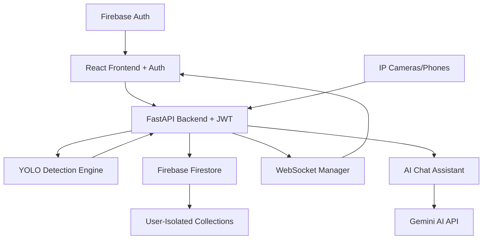

# 🎯 YOLOvFeed - AI-Powered Object Detection Platform

A **enterprise-grade application** for real-time object detection using YOLO with advanced user management, AI analytics, and multi-camera support. Perfect for security monitoring, traffic analysis, and intelligent surveillance systems.

    

## ✨ Key Features

### 🔐 **Advanced Security & User Management**
- **Firebase Authentication** - Secure login with email/password and Google OAuth
- **Multi-User Support** - Complete user isolation and data privacy
- **User-Specific Dashboards** - Each user sees only their own cameras and data
- **Protected Routes** - JWT-based authentication for all API endpoints

### 🎥 **Smart Camera Management**
- **Multi-Camera Support** - Add and manage unlimited IP cameras
- **Real-time YOLO Object Detection** - Powered by YOLOv8n/s/m/l/x models
- **Intelligent Stream Processing** - Adaptive quality and frame rate optimization
- **Camera Ownership** - Users can only control their own cameras

### 🤖 **AI Analytics Assistant**
- **Intelligent Chat Interface** - Ask questions about your camera analytics
- **Natural Language Queries** - "How many people were detected today?"
- **Context-Aware Responses** - AI understands your camera data and provides insights
- **Chat History** - Persistent conversation history per camera

### 📊 **Professional Analytics Dashboard**
- **Real-time Analytics** - Live object counts and detection statistics
- **Historical Data** - Hourly and daily analytics with trend analysis
- **User-Specific Data** - Complete data isolation between users
- **Export & Reporting** - Download analytics data for external analysis

### 💻 **Modern UI/UX**
- **Beautiful Material Design** - Clean, professional interface
- **Responsive Layout** - Works perfectly on desktop, tablet, and mobile
- **Smart Toast Notifications** - Context-aware messaging system
- **Dark/Light Theme Support** - Adaptive visual design
- **Progressive Web App** - Install as native app experience

## 🏗️ Architecture



### 🔧 **Technology Stack**
- **Frontend**: React 18 + TypeScript + Tailwind CSS + Context API
- **Backend**: Python FastAPI + WebSocket + Async Operations
- **Authentication**: Firebase Auth + JWT + Admin SDK
- **Database**: Firebase Firestore with user data isolation
- **Object Detection**: YOLOv8 (ultralytics) with multiple model support
- **AI Assistant**: Google Gemini API integration
- **Real-time Communication**: WebSocket with authentication
- **Deployment**: Docker + Docker Compose

## 🚀 Quick Start

### Prerequisites
- **Node.js 18+** and **npm**
- **Python 3.8+** and **pip**
- **Firebase Project** (for authentication and database)
- **Google AI API Key** (for chat assistant)

### Option 1: Automated Setup (Recommended)

```bash
# Clone the repository
git clone https://github.com/your-username/yolovfeed.git
cd yolovfeed

# Windows
setup.bat

# Linux/Mac
chmod +x setup.sh
./setup.sh
```

### Option 2: Manual Development Setup

#### 1. Firebase Setup
```bash
# Create a Firebase project at https://console.firebase.google.com
# Enable Authentication (Email/Password + Google)
# Enable Firestore Database
# Download service account JSON and place in backend/
# Create frontend/src/config/firebase.ts with your config
```

#### 2. Backend Setup
```bash
cd backend
python -m venv yolov
# Windows
.\yolov\Scripts\activate
# Linux/Mac
source yolov/bin/activate

pip install -r requirements.txt

# Set environment variables
export GOOGLE_AI_API_KEY="your_gemini_api_key"
export FIREBASE_CREDENTIALS_PATH="path/to/service-account.json"

# Start backend
python main.py
```

#### 3. Frontend Setup
```bash
cd frontend
npm install

# Create .env file with Firebase config
npm start
```

### Option 3: Docker Deployment
```bash
# Build and run with Docker Compose
docker-compose up --build

# For production
docker-compose -f docker-compose.prod.yml up -d
```

## 📱 Camera Setup Guide

### Using IP Webcam App (Recommended)

1. **Install IP Webcam** on your Android phone from Google Play Store
2. **Configure the app**:
   - Open IP Webcam
   - Scroll down and tap "Start server"
   - Note the IP address displayed (e.g., `http://192.168.1.100:8080`)
3. **Add to dashboard**:
   - Open the web dashboard
   - Click "Add Camera"
   - Enter camera name and IP address
   - Click "Add Camera"

### Using Other IP Cameras

The application supports any camera that provides an MJPEG stream at `/video` endpoint.

## 🎮 Usage Guide

### 🔐 **Getting Started**
1. **Create Account**: Sign up with email/password or Google account
2. **Secure Login**: Access your personal dashboard with authentication
3. **Private Workspace**: Your cameras and data are completely isolated from other users

### 📱 **Camera Setup**
1. **Add Camera**: Click "Add Camera" and enter camera details
   - **IP Webcam App**: Use format `http://phone-ip:8080/video`
   - **RTSP Cameras**: Use format `rtsp://camera-ip:port/stream`
   - **HTTP Streams**: Use format `http://camera-ip/video`

2. **Camera Controls**: 
   - **Start Streaming**: Begin live video feed
   - **Enable Detection**: Activate YOLO object detection
   - **Stop/Pause**: Control streaming and detection independently

### 🤖 **AI Assistant Usage**
1. **Select Camera**: Choose which camera's data to analyze
2. **Ask Questions**: Natural language queries like:
   - "How many people were detected today?"
   - "What was the busiest hour yesterday?"
   - "Show me the detection trends for this week"
3. **Get Insights**: AI provides detailed analytics and recommendations
4. **Chat History**: Previous conversations are saved per camera

### 📊 **Analytics Dashboard**
- **Real-time Metrics**: Live object counts and detection status
- **Historical Charts**: Hourly and daily trend analysis
- **Object Distribution**: Types of objects detected over time
- **Performance Stats**: Detection accuracy and processing metrics

## 📊 Analytics Features

- **Real-time Object Counts** - Live count of detected objects
- **Historical Analytics** - View detection trends over time
- **Object Type Distribution** - See what types of objects are detected most
- **Per-Camera Statistics** - Individual analytics for each camera
- **Export Data** - Download analytics data (coming soon)

## 🔧 Configuration

### Environment Variables

#### Backend (.env or environment)
```bash
# Firebase Configuration
FIREBASE_CREDENTIALS_PATH=./firebase-service-account.json
FIREBASE_PROJECT_ID=your-project-id

# AI Assistant
GOOGLE_AI_API_KEY=your_gemini_api_key

# Application Settings
ENVIRONMENT=development          # development/production
HOST=0.0.0.0
PORT=8000
DEBUG=true
```

#### Frontend (.env)
```bash
# Firebase Client Configuration
REACT_APP_FIREBASE_API_KEY=your_api_key
REACT_APP_FIREBASE_AUTH_DOMAIN=your-project.firebaseapp.com
REACT_APP_FIREBASE_PROJECT_ID=your-project-id
REACT_APP_FIREBASE_STORAGE_BUCKET=your-project.appspot.com
REACT_APP_FIREBASE_MESSAGING_SENDER_ID=123456789
REACT_APP_FIREBASE_APP_ID=your_app_id

# API Configuration
REACT_APP_API_URL=http://localhost:8000
REACT_APP_WS_URL=ws://localhost:8000
```

### Firebase Setup Guide

1. **Create Firebase Project**:
   - Go to [Firebase Console](https://console.firebase.google.com)
   - Create new project or use existing one

2. **Enable Authentication**:
   - Go to Authentication > Sign-in method
   - Enable Email/Password and Google providers

3. **Setup Firestore**:
   - Go to Firestore Database
   - Create database in production mode
   - Set up security rules for user isolation

4. **Generate Service Account**:
   - Go to Project Settings > Service Accounts
   - Generate new private key
   - Place JSON file in backend folder

5. **Get Client Configuration**:
   - Go to Project Settings > General
   - Add web app and copy config

### YOLO Model Configuration

By default, the application uses `yolov8n.pt` for fast inference. You can change this in `backend/services.py`:

```python
# For better accuracy (slower):
detector = ObjectDetector('yolov8s.pt')  # Small
detector = ObjectDetector('yolov8m.pt')  # Medium
detector = ObjectDetector('yolov8l.pt')  # Large
detector = ObjectDetector('yolov8x.pt')  # Extra Large
```

## 📈 Performance & Security

### 🛡️ **Security Features**
- **JWT Authentication**: All API endpoints require valid tokens
- **User Data Isolation**: Complete separation of user data in Firestore
- **Secure Camera Access**: Users can only control their own cameras
- **Privacy First**: No data sharing between users, local processing
- **Firebase Security Rules**: Database-level access control

### ⚡ **Performance Optimization**
- **Adaptive Frame Rate**: Automatically adjusts based on detection load
- **Smart Resolution**: Optimized at 640x480 for quality/performance balance
- **Efficient Detection**: Runs detection every 3rd frame when enabled
- **Adaptive Quality**: JPEG quality adjusts based on detection status
- **WebSocket Optimization**: Real-time communication with minimal overhead
- **Async Processing**: Non-blocking operations for better responsiveness

### 🎯 **Model Performance**
```python
# Choose based on your hardware:
YOLOv8n: ~5ms inference, 3.2M parameters   # Recommended for real-time
YOLOv8s: ~10ms inference, 11.2M parameters # Balanced accuracy/speed  
YOLOv8m: ~15ms inference, 25.9M parameters # Better accuracy
YOLOv8l: ~20ms inference, 43.7M parameters # High accuracy
YOLOv8x: ~30ms inference, 68.2M parameters # Maximum accuracy
```

## 🛠️ API Documentation

### 🔐 **Authentication Required**
All API endpoints require a valid Firebase JWT token in the Authorization header:
```bash
Authorization: Bearer your_jwt_token
```

### 📚 **Interactive Documentation**
- **Swagger UI**: http://localhost:8000/docs
- **ReDoc**: http://localhost:8000/redoc

### 🔑 **Key Endpoints**

#### **Authentication & User Management**
- `POST /auth/verify` - Verify Firebase token and get user info
- `GET /auth/user` - Get current user profile

#### **Camera Management** 
- `GET /cameras` - List user's cameras (user-isolated)
- `POST /cameras` - Add new camera (auto-assigns to user)
- `DELETE /cameras/{id}` - Delete camera (ownership verified)
- `POST /cameras/{id}/start` - Start camera streaming (ownership verified)
- `POST /cameras/{id}/stop` - Stop camera streaming
- `POST /cameras/{id}/detection/{enabled}` - Toggle detection

#### **Analytics & Data**
- `GET /analytics/{camera_id}` - Get camera analytics (user-filtered)
- `GET /analytics/{camera_id}/hourly` - Hourly analytics aggregation
- `GET /analytics/{camera_id}/export` - Export analytics data

#### **AI Chat Assistant**
- `POST /chat` - Send message to AI assistant
- `GET /chat/history/{camera_id}` - Get chat history (user-isolated)

#### **Real-time Communication**
- `WebSocket /ws` - Real-time updates with authentication
- `WebSocket /camera/{camera_id}/stream` - Camera stream with auth

## 🔒 Security Considerations

- The application runs on your local network
- No external data transmission (privacy-focused)
- Camera streams are processed locally
- SQLite database stores only metadata and analytics

## 🐛 Troubleshooting

### 🔐 **Authentication Issues**
- **Login Problems**: Check Firebase configuration in frontend/.env
- **Token Errors**: Verify Firebase service account JSON is in backend folder
- **Google Sign-in**: Ensure Google OAuth is enabled in Firebase Console
- **User Isolation**: Users can only see their own data - this is normal behavior

### 📱 **Camera Connection Issues**
- Ensure phone and computer are on the same WiFi network
- Check firewall settings allow connections on port 8080
- Verify IP Webcam app is running with server started
- Test camera URL in browser: `http://[phone-ip]:8080/video`
- For RTSP cameras, ensure proper credentials and network access

### 🚀 **Performance Issues**
- Use YOLOv8n model for fastest inference
- Reduce concurrent camera streams (recommended: 2-4 max)
- Close unnecessary browser tabs
- Check available system memory (recommended: 8GB+ RAM)
- Monitor CPU usage and adjust detection intervals

### 🌐 **WebSocket Connection Problems**
- Verify backend is running on correct port (8000)
- Check browser console for WebSocket connection errors
- Try refreshing the page to re-establish connection
- Ensure no proxy/VPN interference
- Check if user is properly authenticated

### 🤖 **AI Assistant Issues**
- Verify Google AI API key is set in environment variables
- Check API quota and billing in Google Cloud Console
- Ensure camera has analytics data before asking questions
- Try simpler queries if complex ones fail

### 🗄️ **Database/Firestore Issues**
- Check Firebase project permissions and service account
- Verify Firestore is enabled and properly configured
- Check Firebase security rules allow authenticated access
- Monitor Firestore usage in Firebase Console

### 🐳 **Docker Issues**
- Ensure Docker Desktop is running
- Check if ports 3000 and 8000 are available
- Verify environment variables are properly mounted
- Check Docker logs: `docker-compose logs -f`

## 📦 Deployment

### Production Deployment

```bash
# Build and deploy with Docker
docker-compose -f docker-compose.prod.yml up --build -d

# Or build for production manually
cd frontend && npm run build
cd ../backend && pip install -r requirements.txt
uvicorn main:app --host 0.0.0.0 --port 8000
```

### Cloud Deployment (Coming Soon)
- AWS/Azure deployment scripts
- Kubernetes manifests
- Terraform configurations

## 🤝 Contributing

We welcome contributions! Please see [DEVELOPMENT.md](DEVELOPMENT.md) for setup instructions.

1. Fork the repository
2. Create a feature branch
3. Make your changes
4. Add tests if applicable
5. Submit a pull request

## 📄 License

This project is licensed under the MIT License - see the [LICENSE](LICENSE) file for details.

## 🙋‍♂️ Support

For support and questions:
- Create an issue on GitHub
- Check the troubleshooting section
- Review the API documentation

## 🔮 Roadmap & Future Features

### 🎯 **Short Term (Next Release)**
- [ ] **Enhanced AI Capabilities**
  - [ ] Multi-language AI assistant support
  - [ ] Voice commands for camera control
  - [ ] Automated report generation
  - [ ] Smart alert system with AI recommendations

- [ ] **Advanced Analytics**
  - [ ] Real-time dashboard widgets
  - [ ] Custom analytics export formats
  - [ ] Multi-camera correlation analysis
  - [ ] Predictive analytics and trends

### 🚀 **Medium Term (3-6 Months)**
- [ ] **Mobile Application**
  - [ ] Native iOS/Android apps
  - [ ] Push notifications for detections
  - [ ] Offline viewing capabilities
  - [ ] Mobile camera streaming

- [ ] **Enterprise Features**
  - [ ] Role-based access control (Admin/User/Viewer)
  - [ ] Organization management
  - [ ] Advanced security logging
  - [ ] SSO integration (LDAP/SAML)

### 🌟 **Long Term (6-12 Months)**
- [ ] **AI & Machine Learning**
  - [ ] Custom YOLO model training interface
  - [ ] Object tracking across frames
  - [ ] Behavioral analysis and anomaly detection
  - [ ] Face recognition with privacy controls

- [ ] **Cloud & Integration**
  - [ ] Multi-cloud deployment options
  - [ ] Third-party security system integration
  - [ ] API marketplace for extensions
  - [ ] Edge computing optimization

- [ ] **Advanced Features**
  - [ ] 4K/8K camera support
  - [ ] PTZ camera control integration
  - [ ] Audio detection and analysis
  - [ ] Thermal camera support

---

**🌟 Star this repository if you find it useful!**

**Made with ❤️ by the YOLOvFeed team for the AI and computer vision community**